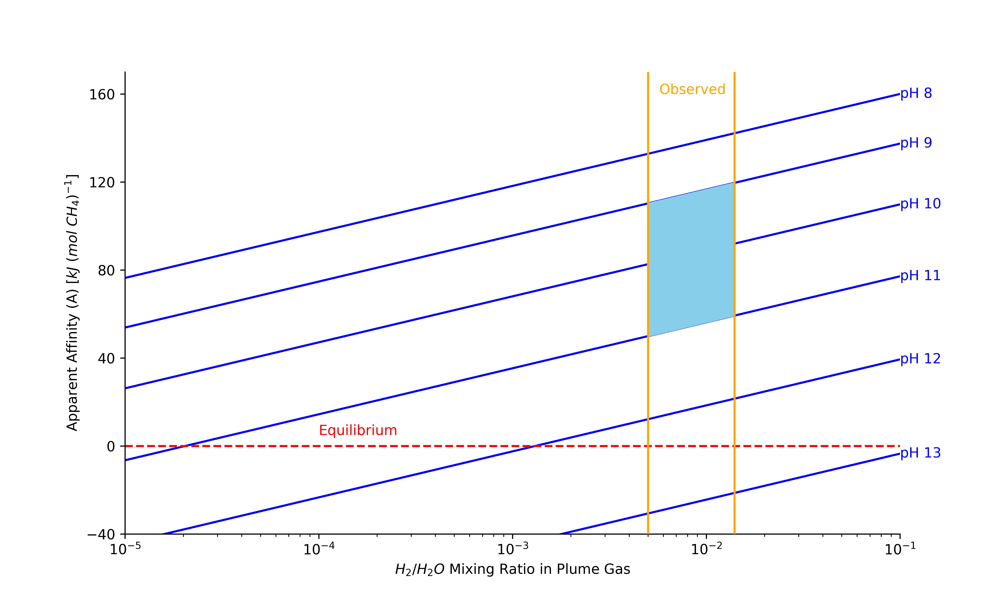

# WIP Documentation of Waite...

# WIP
Recreate Waite's 2017 Figure 4 and Table S11 using the Supcrt16-organics database adapted into Reaktoro.
Waite's 2017 paper analyzes Cassini plume data and derives Figure 4 to f show the 'Apparent chemical affinity for hydrogenotrophic methanogenesis in the ocean of Enceladus'.
**The goal was to recreate this figure using Reaktoro by adapting the Supcrt16-organics database and the associated Table S11, which was used to generate an equation of CO2 molality in the ocean as a function of pH (which was used in deriving Figure 4).

## Table S11
This table shows the volatile composition of the ocean source of Enceladus’ plume using geochemical models at pH 9 and 11. Namely, it gives the molality of CO2, CH4, and H2 at equilibrium for the modeling setup:
1) 0.1 mol Cl-, 0.03 mol Total Dissolved Carbonates (HCO3- and CO3-2), 1kg $H_2O$
2) Equilibrium conditions of 273K and 1bar at pH 9 and 11
3) Concentration of CH4 and H2 is derived from the equilibrium concentration of CO2 using the CH4/CO2 and H2/CO2 ratios in the plume (0.4 and 1.6, respectively).

For specific details on the modeling setup, see the supplementary material of Waite, 2017.

We replicate this modeling setup in Reaktoro and save its calculations to TableS11_Output.txt. See [Waite_2017.py](Waite_2017.py) for documentation.

## Figure 4
This figure from Waite's paper shows the 'Apparent chemical affinity for hydrogenotrophic methanogenesis in the ocean of Enceladus' as a function of a range of H2/H2O mixing ratios in the plume gas. Notably, this is a derived plot with the following modeling setup:
1) The concentration of aqueous H2 and CH4 is derived from the concencentration of CO2, which is a function of pH and derived from Table S11. See the supplementary paper for more details on the f(pH)=CO2
   2) CH4 is derived from CO2 using the relative ratio of 0.4.
   3) H2 is derived from CO2 using different ratios based on the range of H2/H2O ratio and CO2/H2O ratio of 0.055% (See Table 1). Namely, to get the relative ratio of H2/CO2, we divide the range of H2/H2o ratios by 0.055.
      4) According to the plume observed data, the H2/H2O ratio falls between 0.4 to 1.4%, that is plotted between the observed region bars of Figure 4.
5) The disequilibrium constant Q is calculated using the concnetrations of H2, CH4, H2O (1kg) and CO2.
6) The system is equilibriated with 1kg of water and calculates K, the equilbrium constant, using the equilibrium concentrations of H2, CH4, H2O, and CO2.
7) The affinity of the reaction is used via equation S26.

For specific details on the modeling setup, see the supplementary material of Waite, 2017.

We replicate this modeling setup in Reaktoro and save its output figure to [Fig4_Reaction.png](Fig4_Recreation.png). See [Waite_2017.py](Waite_2017.py) for code documentation.

## Results
### Table S11 Replication Figure
[TableS11_Output.txt](TableS11_Output.txt)
### Figure 4 Replication Figure

# Dependencies
- Supcrt16-organics database
- See [documentation file for packages](..\WIP.md)

# Documentation of Code
- Primary documentation of code is in Python file - [Waite_2017.py](Waite_2017.py)