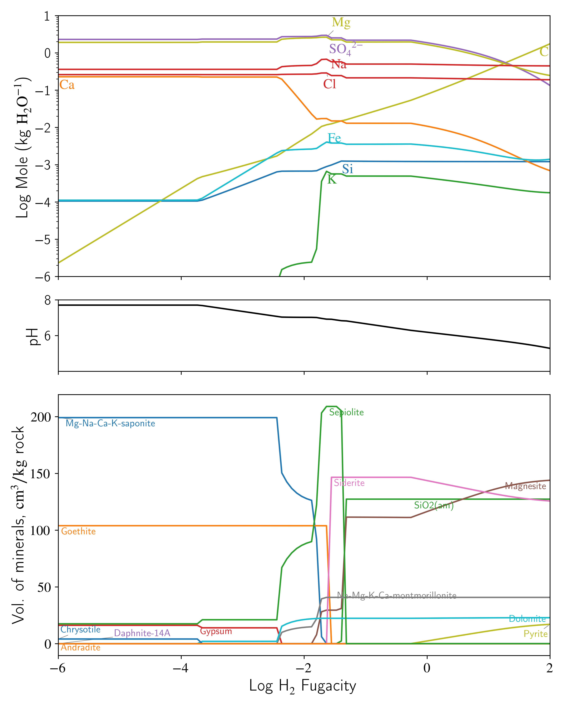
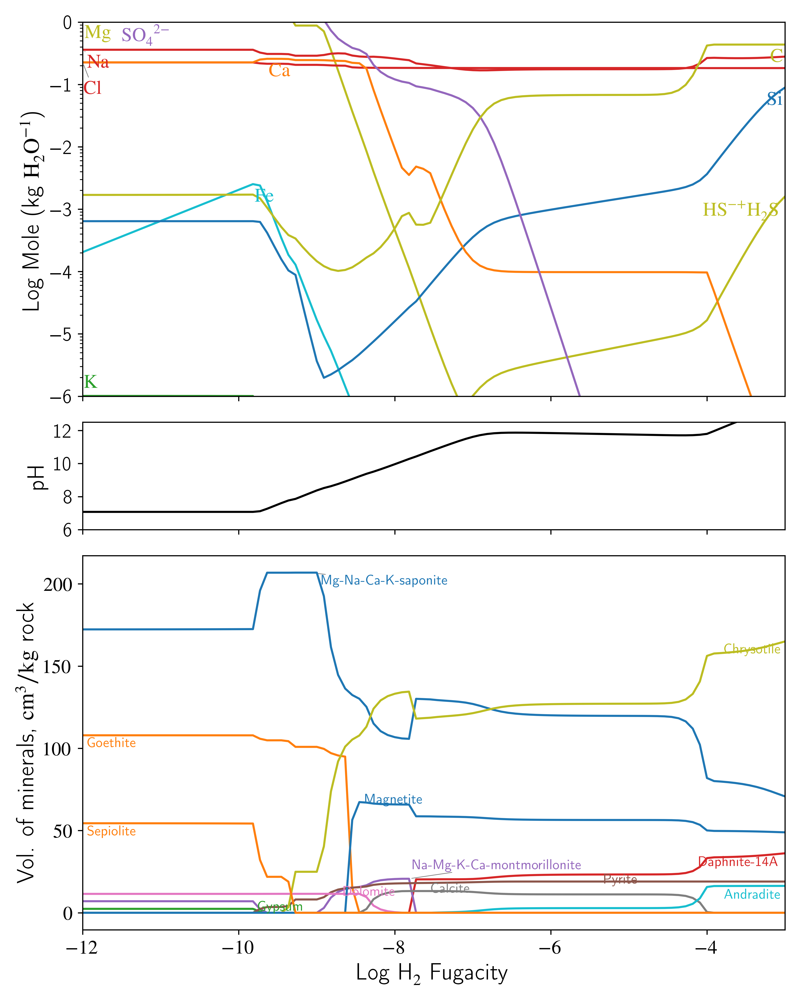

# WIP Documentation of Zolotov...

# WIP
Recreate Zolotov, 2008's $H_2$-fugacity and $CO_2$-fugacity models for Europa's ocean using the Phreeqc's Core11 database adapted into Reaktoro. 
Zolotov's 2008 paper modeled Europa's elemental ocean composition using the GEOCHEQ code, a geochemical model that 'includes properties of one-component solids and non-ideal solid, gas and aqueous solutions.'
**The goal was to recreate both the $H_2$-fugacity and $CO_2$-fugacity models using Reaktoro by adapting the recently updated Core11 database, a PHREEQC-formatted geochemical model that includes has a wide set of aqueous, solid, and gaseous species.**
## Modeling Setup
To replicate Zolotov's elemental ocean models using Reaktoro, we aimed to replicate Zolotov's modeling setup. Namely,
1) Adapt a database into Reaktoro that contains the aqueous and solid species defined in the GEOCHEQ code.
2) Represent the CI Orgueil Chondrite Composition used in the water-rock equilibria
3) Use Reaktoro to define a chemical system of the elements (O-H-C-S-Cl-Na-K-Mg Fe-Ca-Si-Al)
3) Add 1kg of H2O to match W/R of 1 used in both models
4) Equilibriate at 0C, 137.5 MPa, over the approriate range of H2 fugacities, in the case of the $H_2$-fugacity model,or CO2 fugacities.
### Core 11
Given that the Reaktoro package is prepared with databases like Supcrt16, Supcrtbl, and Core10, our decision to adapt the Core11 from Diab et al. was deliberate for the following reasons:
1) Supcrt16 and Supcrtbl lack numerous minerals that are included in the GEOCHEQ database, particularly second-order minerals that control aqueous concentrations such as saponites, montmorillonites, goethite, and magnesite, as well as solid solutions in the GeoCHEQ code (i.e. Na-Mg-Ca-K saponite).
2) Core10 lacks the aqueous and some solid species that are included in the GEOCHEQ database

The Core11 database is an updated PHREEQC-formatted model that includes a wide set of aqueous species and solid species. For example,
Core11 contains 8 different types of saponites, 4 types of montmorillonites, goethite, magnesite, and other solid species that were used in the GEOCHEQ code.
To the point of solid solutions, Reaktoro allows for defining ideal solid solutions from minerals in the Core11 database, which we use to define Mg-Na-Ca-K saponite and Na-Mg-K-Ca montomrillonite.

Another decision was how to represent the CI Orgueil Chondrite composition (defined in [Zolotov, 2009](https://www.uni-muenster.de/imperia/md/content/planetology/lectures/ws2014_15/143478/zolotov_2009.pdf)) to be used for water-rock interactions. 
While GEOCHEQ and other geochemical softwares like PHREEQC allow elemental concentrations to be the constraint on thermodynamic equilibrium, Reaktoro requires an initial disequilibrium state with database species. This implied we had to define a CI Orgueil Chondrite in the Core11 database for the initial chemical state.
Thus, we have modiifed the Core11 database to include a $H_2O$-free CI Orgueil Chondrite composition, labeled CI-Chondrite-Zolotov, with the following balanced reaction equation:

H2.0863O17.8409Na.3540Mg5.6838Al.4813Si5.4510S1.4908K.0184Ca.35Fe4.870Cl.0285C3.3648 + 9.1187 H2O = 0.3540 Na+ + 5.6838 Mg+2 + 0.4813 Al+3 + 5.4510 SiO2 + 1.4908 SO4-2 + 0.0184 K+ + 0.35 Ca+2 + 4.870 Fe+2 + 0.0285 Cl- + 3.3648 HCO3- + 16.9589 H+ + 34.2079 e-

This reaction equation satisfies the Zolotov setup, namely:
1) The Orgueil chondrite composition exactly replicates the elemental composition (mol/kg) defined in the Zolotov, 2009 paper. In the dissolution of the rock with water, the elements are defined in simple aqueous species (Na+, Mg+2) or binary species (SiO2, SO4-2) that are then involved in many other reactions defined in the Core11 databse.
2) We define the chondrite to have a high dissociation constant (akin to NaCl), so that the chondrite immediately dissolves in the presence of our water-rock equilibria and can precipate to minerals or react to other aqueous species as defined by the reactions in the Core11 database.
3) For the H2 fugacity model, Zolotov assumes 10% of the carbon in the chondrite has reacted. To model this with Reaktoro, we create a CI-Chondrite-TenPercent mineral that has 10% of the carbon of the CI chondrite composition.

### Reaktoro
We employ the Core11 database in Reaktoro to define the modeling setup, which can be seen the Replicate_Zolotov_2008.py code. As previously mention, 
we use Reaktoro to define a chemical system of the elements (O-H-C-S-Cl-Na-K-Mg Fe-Ca-Si-Al) and equilibriate at the Zolotov conditions. 

We then have additional code to replicate the plots from Zolotov-2008 and save the speciation output.

## Modeling Setup Differences
- When defining the minerals available in the chemical system, we decided to only include the 'secondary minerals' that Zolotov found to control the aqueous elemental concentrations. This is because Core11 contains minerals that likely not found in the GEOCHEQ code (which we do not have access to) and would likely prevent a genuine replication of the Zolotov modeling system and lead to undesired differences in calculations. 
- The GEOCHEQ code is said to have defined its own non-ideal activity models for solid solutions and aqeuous species. Our Reaktoro setup employs the Pitzer model for aqueous species, Peng-Robinson for gaseous species, and only ideal models for mineral and solid solution species (Reaktoro does not allow for non-ideal solids).

It is our understanding that these differences between the Zolotov setup and Reaktoro setup can explain the discrepancies in our elemental ocean compositions results.

## Results
### Zolotov CO2 Replication Figure

### Zolotov H2 Replication Figure

# Dependencies
- Core11 database from Diab et al. 2023
- See [documentation file for packages](..\WIP.md)

# Documentation of Code
- Primary documentation of code is in Python file - [Replicate_Zolotov_2008.py](Replicate_Zolotov_2008.py)